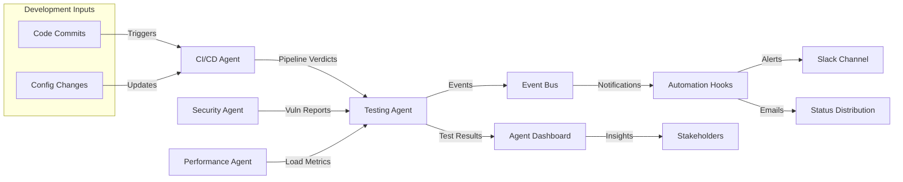
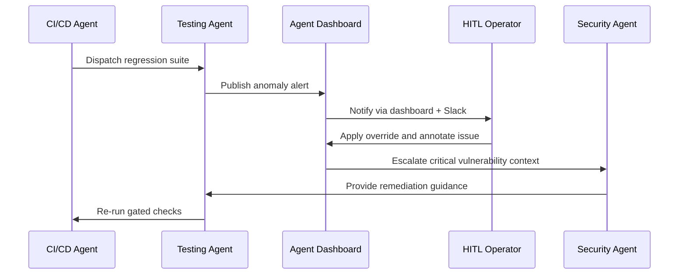

# System Diagrams

The following diagrams illustrate the workflow interconnections and human-in-the-loop (HITL) touchpoints that keep the PR-CYBR Testing Agent aligned with the broader platform.

## Workflow Interconnections

## HITL Touchpoints

> These diagrams use Mermaid syntax and can be rendered directly in GitHub or compatible documentation viewers.
